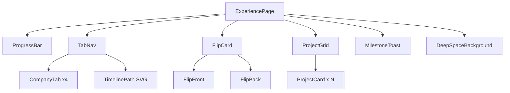

# Design Document: Interactive Experience Page

## Overview

The `ExperiencePage` is redesigned from a static horizontal timeline into a gamified, deep-space career journey. The page is a single React component (`src/pages/ExperiencePage.tsx`) that orchestrates several sub-components and animation layers using Framer Motion, Tailwind CSS, and React state.

The core interaction loop is:
1. Visitor lands on the page — the first company is pre-selected, the progress bar shows 25%.
2. Visitor clicks a company tab — the tab unlocks (with an animation), the flip card rotates to reveal details, project cards bounce in, and the progress bar advances.
3. Milestone companies (Accenture, Self-employed) trigger a toast notification on first visit.
4. Scrolling the project grid produces a parallax depth effect.

All logic lives inside `ExperiencePage.tsx` with small, focused sub-components co-located in the same file or extracted to `src/components/` only when they exceed ~80 lines.

---

## Architecture



**State flows downward** from `ExperiencePage` via props. All mutable state lives in `ExperiencePage`:

| State | Type | Purpose |
|---|---|---|
| `activeIndex` | `number` | Currently selected company (0–3) |
| `visitedCompanies` | `Set<number>` | Companies clicked at least once |
| `isFlipped` | `boolean` | Whether the flip card shows its back face |
| `milestoneShown` | `Set<number>` | Milestone toasts already displayed |
| `toastData` | `{ company: string; role: string } \| null` | Active toast payload |

---

## Components and Interfaces

### `ExperiencePage` (root)

Owns all state. Renders the full page layout.

```ts
// No external props — it is a page-level component
```

### `ProgressBar`

```ts
interface ProgressBarProps {
  visited: number;   // count of unique visited companies
  total: number;     // always 4
  accentColors: string[]; // colors of visited companies in visit order
}
```

Renders a `<div>` with an animated inner fill. Uses Framer Motion `animate={{ width: \`${pct}%\` }}` with `transition={{ duration: 0.6 }}`. Displays a numeric `{pct}%` label.

### `CompanyTab`

```ts
interface CompanyTabProps {
  company: CompanyData;
  isActive: boolean;
  isLocked: boolean;
  onClick: () => void;
}
```

Renders the logo, company name, and a `LockIcon` overlay when `isLocked`. Applies `GlowEffect` on hover and active state via inline `boxShadow` using `company.accentColor`.

### `TimelinePath`

```ts
interface TimelinePathProps {
  activeIndex: number;
  count: number; // always 4
}
```

An SVG element absolutely positioned behind the tab row. Uses Framer Motion `pathLength` animation on mount (0 → 1 over 1200ms). On `activeIndex` change, a secondary animated segment pulses toward the active tab.

### `FlipCard`

```ts
interface FlipCardProps {
  company: CompanyData;
  isFlipped: boolean;
  onFlip: () => void;
}
```

Uses CSS `perspective: 1000px` on the wrapper and `rotateY` on the inner container. Front shows logo + name + role + dates. Back shows description + achievement bullets. Framer Motion `animate={{ rotateY: isFlipped ? 180 : 0 }}` with `transition={{ duration: 0.5 }}`.

### `ProjectCard`

```ts
interface ProjectCardProps {
  project: ProjectData;
  accentColor: string;
  index: number; // for stagger delay
}
```

Renders title, description, tech tags, and a stat badge. Top accent bar uses `accentColor`. Hover triggers `whileHover={{ y: -6, scale: 1.03 }}`. Shows a `TooltipPreview` on hover via conditional render + `AnimatePresence`.

### `ProjectGrid`

```ts
interface ProjectGridProps {
  projects: ProjectData[];
  accentColor: string;
  scrollY: MotionValue<number>; // from useScroll
}
```

Wraps cards in a `motion.div` whose `y` is derived via `useTransform(scrollY, [0, 500], [0, 80])` (clamped to 80px). Cards animate in with staggered spring on mount/change.

### `MilestoneToast`

```ts
interface MilestoneToastProps {
  company: string;
  role: string;
  onDismiss: () => void;
}
```

Fixed-position overlay at top-center. Animates in with `y: -60 → 0` + `opacity: 0 → 1` over 400ms. Auto-dismisses after 3000ms via `useEffect` timeout.

---

## Data Models

### `CompanyData`

```ts
interface CompanyData {
  id: number;
  company: string;
  role: string;
  period: string;
  accentColor: string;
  logoSrc: string;       // e.g. "/logos/accenture_logo.svg"
  description: string;
  achievements: string[];
  projects: ProjectData[];
  isMilestone: boolean;
}
```

### `ProjectData`

```ts
interface ProjectData {
  title: string;
  description: string;
  tags: string[];
  stat: string;          // e.g. "150K chats/day"
}
```

### Static data constant

```ts
const COMPANIES: CompanyData[] = [
  {
    id: 0,
    company: 'University of Málaga',
    role: 'CS Student',
    period: '2015 – 2019',
    accentColor: '#38bdf8',
    logoSrc: '/logos/universidad_de_malaga_logo.svg',
    description: 'Built a strong foundation in computer science fundamentals...',
    achievements: ['Graduated with honors', 'Specialized in distributed systems'],
    projects: [...],
    isMilestone: false,
  },
  {
    id: 1,
    company: 'Accenture',
    role: 'Data Scientist',
    period: '2021 – 2023',
    accentColor: '#a78bfa',
    logoSrc: '/logos/accenture_logo.svg',
    description: 'Developed and deployed 12+ ML models...',
    achievements: ['25% accuracy improvement', '50K+ users served'],
    projects: [...],
    isMilestone: true,
  },
  {
    id: 2,
    company: 'ARHS Group',
    role: 'Full-Stack AI Developer',
    period: '2023 – 2024',
    accentColor: '#34d399',
    logoSrc: '/logos/arhs_group_logo.svg',
    description: 'Designed 8+ AI-driven full-stack features...',
    achievements: ['30% workflow efficiency gain', '78K+ daily requests'],
    projects: [...],
    isMilestone: false,
  },
  {
    id: 3,
    company: 'Self-employed',
    role: 'Senior Software Engineer',
    period: '2025 – Present',
    accentColor: '#fb923c',
    logoSrc: '/logos/self-employed_logo.svg',
    description: 'Delivering scalable full-stack and AI-driven solutions...',
    achievements: ['International client base', 'Next-gen trading terminals'],
    projects: [...],
    isMilestone: true,
  },
]
```

### Progress calculation

```ts
const progressPct = (visitedCompanies.size / COMPANIES.length) * 100
// Initial render: visitedCompanies = new Set([0]) → 25%
```

### Milestone companies

Determined by `company.isMilestone === true` (Accenture at index 1, Self-employed at index 3).

---

## Correctness Properties

*A property is a characteristic or behavior that should hold true across all valid executions of a system — essentially, a formal statement about what the system should do. Properties serve as the bridge between human-readable specifications and machine-verifiable correctness guarantees.*


### Property 1: Progress percentage formula

*For any* number of visited companies between 1 and 4, the computed progress percentage must equal `(visitedCount / 4) * 100`, and the numeric label rendered in the ProgressBar must display that same value.

**Validates: Requirements 1.2, 1.5**

### Property 2: Progress bar gradient uses visited accent colors

*For any* sequence of visited companies, the ProgressBar fill gradient must include the accent color of the first visited company as its start stop and the accent color of the most recently visited company as its end stop.

**Validates: Requirements 1.6**

### Property 3: CompanyTab renders complete company identity

*For any* company in the COMPANIES data array, the rendered CompanyTab must contain an `` with the correct `src` matching `company.logoSrc` and a text node matching `company.company`.

**Validates: Requirements 2.2**

### Property 4: Clicking any tab sets it as the active tab

*For any* valid tab index (0–3), after a click event is fired on that tab, the `activeIndex` state must equal that index.

**Validates: Requirements 2.4**

### Property 5: Active tab is visually distinguished

*For any* active tab index, the active tab's container element must have a different border color and box-shadow than all other tab elements, using the company's `accentColor`.

**Validates: Requirements 2.5**

### Property 6: Unvisited tabs display LockIcon

*For any* company index not present in `visitedCompanies`, the corresponding CompanyTab must render a LockIcon element; for any index present in `visitedCompanies`, no LockIcon must be rendered.

**Validates: Requirements 2.6, 9.3**

### Property 7: FlipCard surfaces contain complete company data

*For any* company, the FlipCard front face must contain the company logo, company name, role title, and date range; the FlipCard back face must contain the role description and all achievement bullet points.

**Validates: Requirements 4.2, 4.3**

### Property 8: Project cards visible when flip card is on back face

*For any* active company with `isFlipped = true`, the ProjectCard list must be rendered in the DOM; with `isFlipped = false`, the ProjectCard list must not be rendered.

**Validates: Requirements 4.5**

### Property 9: Flip toggle is a round trip

*For any* active company, toggling `isFlipped` from `false → true → false` must return the component to its original state with the front face visible and no ProjectCards rendered.

**Validates: Requirements 4.7**

### Property 10: ProjectCard count matches company project count

*For any* active company with N projects in its `projects` array, exactly N ProjectCard elements must be rendered in the ProjectGrid.

**Validates: Requirements 5.1**

### Property 11: ProjectCard contains all required data fields

*For any* project in any company's project list, the rendered ProjectCard must contain the project title, description text, all tech tag strings, and the stat badge text.

**Validates: Requirements 5.3**

### Property 12: ProjectCard accent bar uses company accent color

*For any* active company, every ProjectCard rendered for that company must have a top accent bar whose background color matches the company's `accentColor`.

**Validates: Requirements 5.4**

### Property 13: Parallax translation is proportional and bounded

*For any* scroll Y value, the computed parallax translation must equal `scrollY * 0.6` and must be clamped to the range `[0, 80]` pixels — never exceeding 80px regardless of scroll depth.

**Validates: Requirements 6.2, 6.4**

### Property 14: Milestone toast shown with correct content on first visit

*For any* milestone company (where `isMilestone = true`), clicking its tab for the first time must cause a MilestoneToast to appear containing the text "Milestone Unlocked", the company name, and the role title.

**Validates: Requirements 7.2, 7.3**

### Property 15: Milestone toast shown at most once per company per session

*For any* milestone company, clicking its tab a second or subsequent time must not trigger a new MilestoneToast — `milestoneShown` must contain the company index after the first visit and prevent re-display.

**Validates: Requirements 7.6**

### Property 16: Clicking a tab adds its index to visitedCompanies

*For any* tab index, after a click event on that tab, the `visitedCompanies` set must contain that index; subsequent clicks on the same tab must not change the size of `visitedCompanies`.

**Validates: Requirements 9.2**

### Property 17: Card surfaces apply backdrop blur

*For any* rendered card surface (FlipCard, ProjectCard, detail panel), the element's style must include `backdropFilter: blur(12px)`.

**Validates: Requirements 8.3**

### Property 18: AccentColors match specification

*For any* company in the COMPANIES array, the `accentColor` field must exactly match the specified value: University of Málaga → `#38bdf8`, Accenture → `#a78bfa`, ARHS Group → `#34d399`, Self-employed → `#fb923c`.

**Validates: Requirements 8.4**

---

## Error Handling

**Missing logo files**: If a logo SVG fails to load, the `` element will render with its `alt` text. No special error boundary is needed — the layout degrades gracefully.

**Empty projects array**: If a company has zero projects, the ProjectGrid renders an empty container. No crash occurs because `Array.map` on an empty array returns `[]`.

**Invalid activeIndex**: The `activeIndex` is always set by clicking a tab from the fixed COMPANIES array (indices 0–3), so out-of-bounds access is not possible in normal usage.

**Toast timer cleanup**: The `MilestoneToast` `useEffect` timeout must be cleared on unmount to prevent state updates on an unmounted component:

```ts
useEffect(() => {
  const id = setTimeout(onDismiss, 3000)
  return () => clearTimeout(id)
}, [onDismiss])
```

**Scroll listener cleanup**: `useScroll` from Framer Motion manages its own cleanup internally — no manual `removeEventListener` is needed.

---

## Testing Strategy

### Dual Testing Approach

Both unit tests and property-based tests are required. They are complementary:
- Unit tests cover specific examples, integration points, and edge cases.
- Property-based tests verify universal invariants across randomized inputs.

### Unit Tests (Vitest + React Testing Library)

Focus on concrete examples and integration:

- **Render smoke test**: ExperiencePage mounts without errors.
- **Initial state example**: On mount, `visitedCompanies` contains index 0, ProgressBar shows "25%".
- **Timeline SVG example**: SVG element with `linearGradient` stops `#38bdf8` and `#fb923c` is present.
- **FlipCard perspective example**: FlipCard wrapper has `perspective: 1000px` in its style.
- **Background style example**: Root element has `backgroundImage: url(/experience.png)` and `backgroundSize: cover`.
- **Milestone companies example**: At least two entries in COMPANIES have `isMilestone: true`.
- **Toast auto-dismiss example**: Using fake timers, MilestoneToast is removed from DOM after 3000ms.
- **ParallaxLayer example**: ProjectGrid wrapper is a `motion.div` with a `y` motion value.

### Property-Based Tests (fast-check + Vitest)

Each property test runs a minimum of **100 iterations**. Each test is tagged with a comment referencing the design property.

Tag format: `// Feature: interactive-experience-page, Property {N}: {property_text}`

| Property | Test description | Generator |
|---|---|---|
| P1 | Progress pct formula holds for all visited counts | `fc.integer({ min: 1, max: 4 })` |
| P2 | Gradient includes first and last visited accent colors | `fc.array(fc.integer({min:0,max:3}), {minLength:1,maxLength:4})` |
| P3 | All company tabs render logo src and name | `fc.constantFrom(...COMPANIES)` |
| P4 | Clicking any tab index sets it active | `fc.integer({ min: 0, max: 3 })` |
| P5 | Active tab has distinct border from inactive tabs | `fc.integer({ min: 0, max: 3 })` |
| P6 | LockIcon present iff index not in visitedCompanies | `fc.subarray([0,1,2,3])` for visited set |
| P7 | FlipCard front+back contain all company data fields | `fc.constantFrom(...COMPANIES)` |
| P8 | ProjectCards visible iff isFlipped=true | `fc.boolean()` for isFlipped |
| P9 | Double flip returns to original state | `fc.integer({ min: 0, max: 3 })` |
| P10 | ProjectCard count equals company.projects.length | `fc.constantFrom(...COMPANIES)` |
| P11 | ProjectCard contains title, desc, tags, stat | `fc.constantFrom(...all projects)` |
| P12 | ProjectCard accent bar color matches company accentColor | `fc.constantFrom(...COMPANIES)` |
| P13 | Parallax y = clamp(scrollY * 0.6, 0, 80) | `fc.float({ min: 0, max: 500 })` for scrollY |
| P14 | Milestone toast content correct on first visit | `fc.constantFrom(...milestone companies)` |
| P15 | Milestone toast not shown on repeat visit | `fc.integer({ min: 2, max: 5 })` for click count |
| P16 | Clicking tab adds index to visitedCompanies idempotently | `fc.integer({ min: 0, max: 3 })` |
| P17 | Card surfaces have backdropFilter blur(12px) | `fc.constantFrom(...COMPANIES)` |
| P18 | AccentColors match specification exactly | `fc.constantFrom(...COMPANIES)` |

### Testing Library Choices

- **Unit tests**: Vitest + `@testing-library/react` + `@testing-library/user-event`
- **Property-based tests**: `fast-check` (TypeScript-native, integrates with Vitest)
- **Fake timers**: Vitest's built-in `vi.useFakeTimers()` for toast auto-dismiss test
